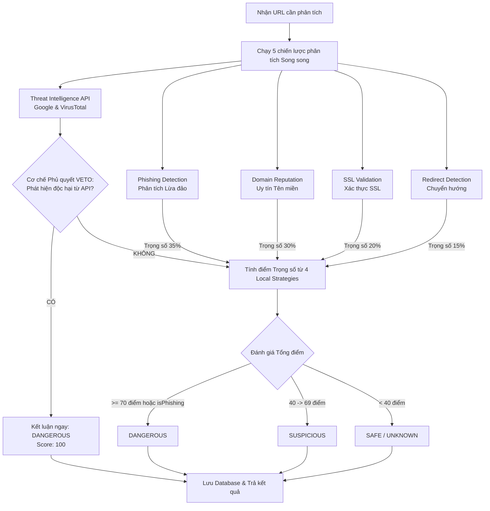
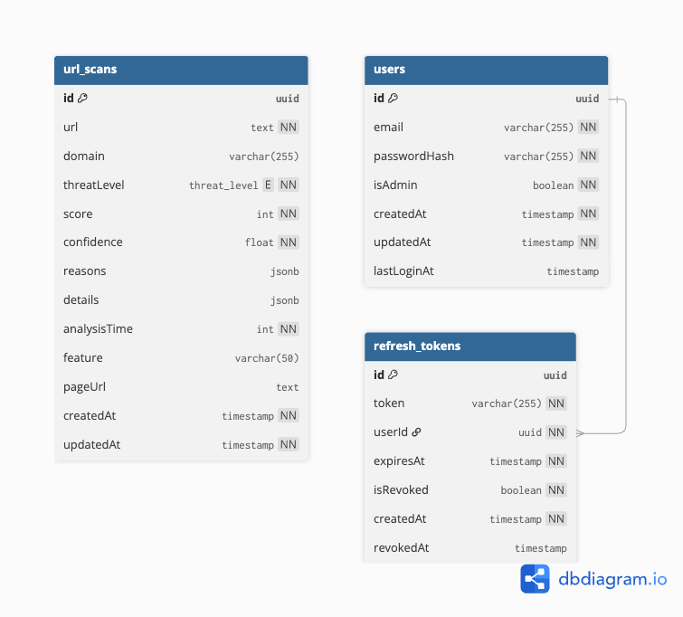
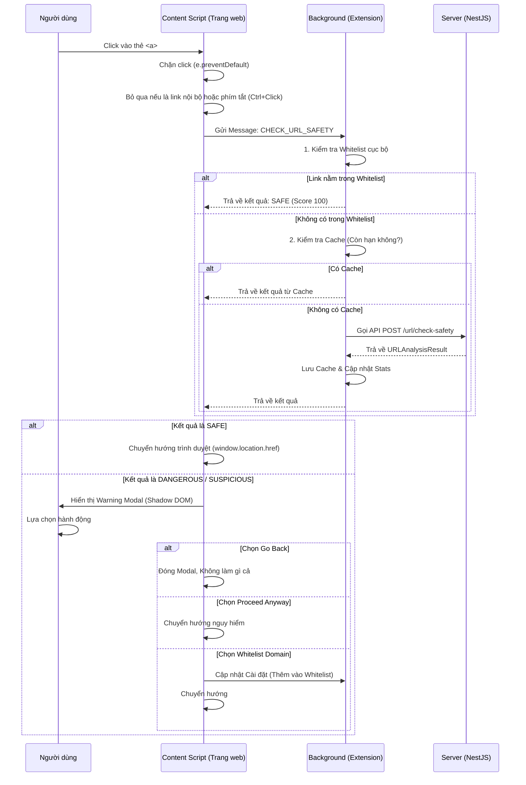
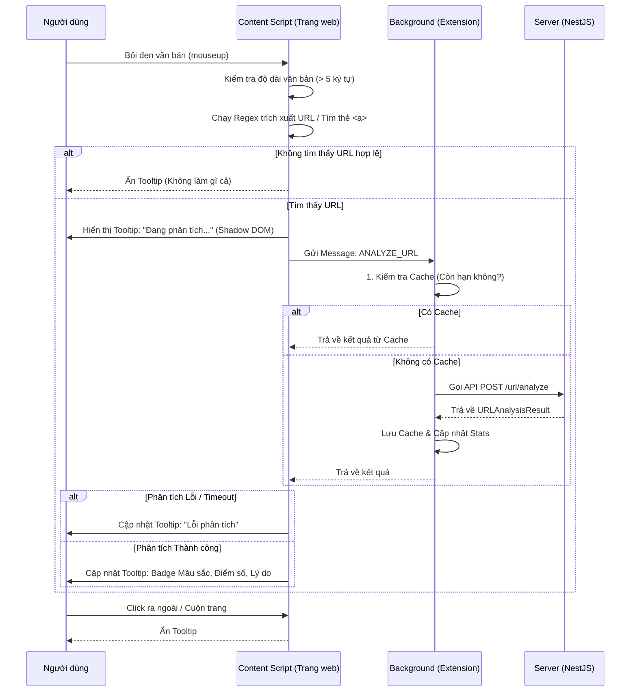

## Tài liệu Kiến trúc và Cơ chế Phân tích URL Độc hại
## I. CƠ SỞ LÝ THUYẾT
### 1. Tổng quan (Overview)
Module url-analysis là một hệ thống kiểm tra và đánh giá độ an toàn của một đường dẫn (URL) dựa trên phương pháp Phân tích đa lớp (Multi-layered Analysis).

Thay vì chỉ dựa vào một phương pháp duy nhất, hệ thống kết hợp giữa:

- Tra cứu Tình báo Mối đe dọa (**Threat Intelligence**): Hỏi các cơ sở dữ liệu an ninh mạng hàng đầu thế giới (Google Safe Browsing, VirusTotal) xem URL này đã bị "đưa vào danh sách đen" chưa.

- Phân tích Heuristic tại chỗ (**Local Heuristic Strategies**): Tự động phân tích các đặc điểm, cú pháp và hành vi của URL (như chứng chỉ SSL, lỗi chính tả tên miền, số lần chuyển hướng) để phát hiện các mối đe dọa Zero-day (chưa từng xuất hiện trên database của Google/VirusTotal).

### 2. Lưu đồ Hoạt động (Workflow)
Lưu đồ dưới đây mô tả quá trình từ khi nhận một URL cho đến khi trả về kết quả đánh giá:

### 3. Lớp Bảo vệ 1: Tình báo Mối đe dọa Bên ngoài (External Threat Intelligence)
Hệ thống sử dụng cơ chế Veto (Phủ quyết). Nếu một trong hai nhà cung cấp dưới đây báo cáo URL là độc hại, hệ thống lập tức dán nhãn DANGEROUS (nguy hiểm) và cho điểm tối đa (100) mà không cần quan tâm đến các chỉ số phân tích tĩnh khác.

#### 3.1. Google Safe Browsing (GSB)
**Khái niệm**: GSB là một dịch vụ do Google cung cấp, chứa danh sách các URL liên quan đến phần mềm độc hại (Malware) hoặc nội dung lừa đảo (Social Engineering/Phishing).

**Độ uy tín**: Cực kỳ uy tín. Đây là tiêu chuẩn vàng của ngành công nghiệp web, đang bảo vệ hơn 5 tỷ thiết bị và được tích hợp mặc định trong các trình duyệt lớn như Google Chrome, Apple Safari, Mozilla Firefox.

**Cách triển khai**: Hệ thống gửi URL qua API threatMatches:find của Google. Nếu Google trả về matches lớn hơn 0, URL bị coi là mối đe dọa.

Reference: [Detail](https://developers.google.com/safe-browsing/v4/reference/rest/v4/threatMatches/find)

#### 3.2. VirusTotal (VT)
**Khái niệm**: VirusTotal (thuộc sở hữu của công ty con của Google là Chronicle Security) không phải là một trình diệt virus đơn lẻ, mà là một Aggregator (bộ tổng hợp). Khi bạn gửi URL lên VT, nó sẽ hỏi ý kiến của hơn 70 engine bảo mật khác nhau trên thế giới (như Kaspersky, BitDefender, Fortinet, McAfee...).

**Độ uy tín**: Cực kỳ uy tín và toàn diện. Nó bao quát được kết quả của gần như toàn bộ ngành công nghiệp an ninh mạng.

**Cách triển khai**: Encode URL dạng Base64 và gọi API /urls/. Hệ thống kiểm tra chỉ số malicious (số lượng engine báo độc hại). Nếu > 0, kích hoạt Veto.

Reference: [Detail](https://docs.virustotal.com/reference/url-info)

### 4. Lớp Bảo vệ 2: Phân tích Tĩnh và Hành vi (Local Heuristic Strategies)
Nếu URL "lọt lưới" Google và VirusTotal (có thể là một đường link lừa đảo vừa mới được tạo ra cách đây 1 phút), hệ thống sẽ dùng các chiến lược nội bộ để tự đánh giá. Tổng điểm 100 được chia theo trọng số sau:

#### 4.1. Phishing Detection - Phát hiện Lừa đảo (Trọng số 35%)
**Cơ sở lý thuyết**: Phishing là hành vi giả mạo các tổ chức uy tín (ngân hàng, MXH) để đánh cắp thông tin đăng nhập. Kẻ tấn công thường dùng kỹ thuật Typosquatting (cố tình viết sai chính tả tên miền, ví dụ facebook.com thành faceb00k.com hoặc rnicrosoft.com) và dùng các từ khóa gây áp lực tâm lý (urgent, verify, suspend).

**Cách thức triển khai**:

- Quét các từ khóa nhạy cảm trong URL (login, banking, paypal...).

- Dùng thuật toán Khoảng cách Levenshtein (Levenshtein distance) để đo mức độ khác biệt giữa domain đang xét với các domain hợp pháp (Google, Apple, Facebook...). Nếu khoảng cách là 1-2 ký tự, đánh dấu ngay là lừa đảo (Typosquatting).

- Kiểm tra các kỹ thuật che giấu (URL obfuscation) như chứa ký tự @ hoặc quá nhiều dấu chấm.

#### 4.2. Domain Reputation - Uy tín Tên miền (Trọng số 30%)
**Cơ sở lý thuyết**: Hacker hiếm khi mua các tên miền ngắn, đẹp vì tốn kém và dễ bị thu hồi. Chúng thường dùng DGA (Domain Generation Algorithms) tạo ra các tên miền dài ngoằng, vô nghĩa, chứa nhiều số/ký tự đặc biệt, hoặc sử dụng dịch vụ rút gọn link để che giấu đích đến.

**Cách thức triển khai**:

- Phạt điểm nặng nếu dùng dịch vụ rút gọn (bit.ly, tinyurl) hoặc dùng trực tiếp địa chỉ IP thay vì chữ (ví dụ: http://192.168.1.1/login).

- Phạt điểm nếu tên miền dài quá 30 ký tự, có quá 2 subdomain (ví dụ: a.b.c.domain.com), hoặc chứa nhiều số và dấu gạch ngang (-).

#### 4.3. SSL Validation - Xác thực Chứng chỉ (Trọng số 20%)
**Cơ sở lý thuyết**: Bất kỳ trang web hợp pháp nào (đặc biệt là trang có form đăng nhập) đều phải mã hóa dữ liệu truyền tải bằng HTTPS và chứng chỉ SSL phải do một Tổ chức chứng thực (CA) cấp.

**Cách thức triển khai**:

- Nếu dùng http:// thay vì https:// -> Phạt điểm.

- Mở kết nối TLS (Transport Layer Security) thực tế đến máy chủ. Kiểm tra xem chứng chỉ có hết hạn không, có hợp lệ không.

- Phạt điểm nếu đó là chứng chỉ tự ký (Self-signed certificate) - dấu hiệu hacker tự tạo server để hứng dữ liệu.

#### 4.4. Redirect Detection - Phát hiện Chuyển hướng (Trọng số 15%)
**Cơ sở lý thuyết**: Hacker thường tạo ra một chuỗi các trang web chuyển hướng (Redirect Chain) hoặc chuyển hướng chéo tên miền (Cross-domain redirect) để lách qua các bộ lọc thư rác.

**Cách thức triển khai**:

- Thực hiện HTTP GET Request thực tế với header User-Agent mô phỏng người dùng.

- Đếm số lần chuyển hướng. Càng chuyển hướng nhiều (đặc biệt khác tên miền gốc), điểm phạt càng cao.

- Cơ chế Whitelist (Danh sách trắng): Các tính năng Đăng nhập một lần (SSO/OAuth) của Google, Facebook, Apple... cũng bắt buộc phải chuyển hướng chéo tên miền. Để tránh báo động giả, hệ thống có một danh sách trustedRedirectDomains. Nếu URL đích cuối cùng nằm trong Whitelist này (ví dụ: accounts.google.com), hệ thống ghi nhận đây là chuyển hướng hợp lệ và không phạt điểm.

### 5. Đánh giá Mức độ Đe dọa (Threat Level Classification)
Dựa trên kết quả trả về, module phân loại mức độ đe dọa của URL thành các cấp bậc:

**DANGEROUS (Nguy hiểm)**:

- Bị VETO bởi Google Safe Browsing hoặc VirusTotal.

- HOẶC tổng điểm phân tích nội bộ Score >= 70.

- HOẶC chiến lược Phishing Detection kết luận isPhishing = true.

- Hành động khuyên dùng: Chặn hoàn toàn người dùng truy cập.

**SUSPICIOUS (Đáng ngờ)**:

- Tổng điểm nằm trong khoảng 40 <= Score < 70.

- Thường là các trang web có cấu hình bảo mật kém (lỗi SSL, dùng domain lạ) nhưng chưa có bằng chứng rõ ràng là lừa đảo.

- Hành động khuyên dùng: Cảnh báo người dùng trước khi họ click.

**SAFE (An toàn)**:

- Tổng điểm Score < 20.

- Vượt qua tất cả các bài kiểm tra với điểm phạt rất thấp.

**UNKNOWN (Không xác định)**:

- Trường hợp 1 (Vùng xám): Tổng điểm nằm trong khoảng 20 <= Score < 40. URL có một vài điểm trừ nhỏ (ví dụ: HTTP hoặc domain hơi dài) nhưng chưa đủ mức để bị gọi là đáng ngờ.

- Trường hợp 2 (Lỗi kỹ thuật): Quá trình quét bị lỗi mạng, timeout hoặc không thể phân tích được URL do server đích chặn kết nối. Lúc này hệ thống tự động gán Score = 50 và Confidence = 0.

- Hành động khuyên dùng: Ghi log theo dõi thêm, hệ thống hoạt động như đối với link an toàn nhưng không cấp chứng nhận "An toàn tuyệt đối".

## II. Triển khai 
### 1. Kiến trúc Tổng thể (System Architecture)
Hệ thống LinkGuard được thiết kế theo mô hình Client-Server, trong đó:

Client: Landing page, Thống kê dữ liệu của hệ thống.

Extension (Chrome Extension - React/Vite/TS): Hoạt động như một "khiên bảo vệ" trực tiếp trên trình duyệt của người dùng. Chịu trách nhiệm bắt các sự kiện (click, bôi đen), quản lý cache, hiển thị giao diện cảnh báo và gửi yêu cầu lên Server.

Server (NestJS API): Đóng vai trò là "bộ não" phân tích nặng. Chịu trách nhiệm chạy các chiến lược Heuristic, giao tiếp với các API bên thứ 3 (Google, VirusTotal) và lưu trữ lịch sử quét vào Database.

### 2. Sơ đồ Usecase (Usecase Diagram)
Hệ thống xoay quanh 2 Actor chính: Người dùng cuối (End-User) và Hệ thống ngầm (Background Service).

Nhóm Usecase của Người dùng:

- **UC1**: Bôi đen văn bản chứa link (Text Selection): Xem nhanh mức độ an toàn của link qua Tooltip mà không cần click.

- **UC2**: Click vào link (Click Protection): Nhận cảnh báo Modal (Popup chèn giữa màn hình) nếu link độc hại trước khi trình duyệt chuyển hướng.

### 3. Thiết kế Cơ sở dữ liệu (Database Design)
Hệ thống gồm 3 bảng chính:

#### 3.1. Bảng users (Quản lý tài khoản)
- id (UUID - PK): Khóa chính.

- email (Varchar - Unique): Email đăng nhập.

- passwordHash (Varchar): Mật khẩu mã hóa (Bcrypt).

- isAdmin (Boolean): Quyền quản trị.

- lastLoginAt (Timestamp): Lần đăng nhập cuối.

#### 3.2. Bảng refresh_tokens (Bảo mật phiên đăng nhập)
- id (UUID - PK): Khóa chính.

- token (Varchar - Unique): Chuỗi token để cấp lại Access Token.

- userId (UUID - FK): Liên kết tới bảng users.

- expiresAt (Timestamp): Thời hạn token.

- ipAddress (Varchar): IP thiết bị lúc login (Phục vụ truy vết an ninh).

- userAgent (Text): Dấu vân tay thiết bị trình duyệt (Phục vụ truy vết an ninh).

#### 3.3. Bảng url_scans (Lịch sử & Phân tích Telemetry)
Lưu lại toàn bộ các URL đã được quét để phục vụ báo cáo và Machine Learning sau này.

- id (UUID - PK): Khóa chính.

- url (Text - Index): Đường dẫn đầy đủ đã quét.

- domain (Varchar - Index): Tên miền trích xuất từ URL.

- threatLevel (Enum): Kết quả (safe, suspicious, dangerous, unknown).

- score (Int): Điểm rủi ro (0-100).

- confidence (Float): Độ tin cậy của thuật toán (0-1).

- reasons (JSONB): Mảng các lý do bị phạt điểm (VD: "Thiếu SSL", "Chứa từ khóa lừa đảo").

- feature (Varchar): Nguồn quét (text-selection hoặc click-protection).

- ipAddress (Inet): IP của người dùng thực hiện lệnh quét.

- userAgent (Text): Trình duyệt người dùng đang sử dụng.

### 4. Lưu đồ Logic cho các Chức năng cốt lõi (Core Feature Flows)
#### 4.1. Tính năng Bảo vệ Click (Click Protection)
Can thiệp vào giai đoạn Capture Phase trước khi trình duyệt kịp chuyển trang.

#### 4.2. Tính năng Lựa chọn Văn bản (Text Selection Tooltip)
Giúp người dùng kiểm tra các đoạn text nghi ngờ là link mà không cần bấm vào.

